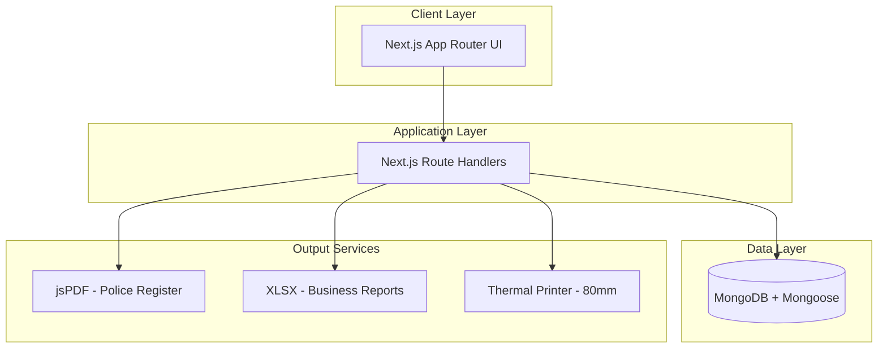
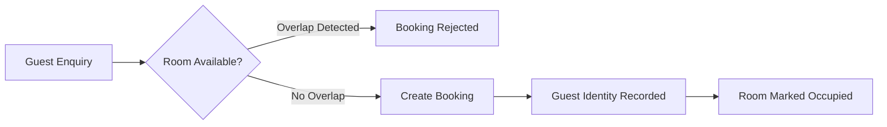
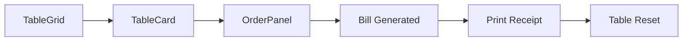
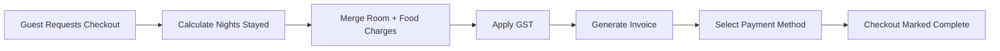

# OG PMS — Hotel Management & Restaurant POS Platform

Full-stack hotel operations platform unifying **room bookings, guest verification, restaurant POS billing, GST reporting, and police register export** in a single system.

Built with **Next.js**, **MongoDB**, and **Tailwind CSS**.

---

## Table of Contents

- [System Overview](#system-overview)
- [System Architecture](#system-architecture)
- [Business Modules](#business-modules)
- [Tech Stack](#tech-stack)
- [Project Structure](#project-structure)
- [Business Workflows](#business-workflows)
- [API Overview](#api-overview)
- [Database Schemas](#database-schemas)
- [Business Logic](#business-logic)
- [Installation](#installation)
- [Environment Variables](#environment-variables)
- [Screenshots](#screenshots)
- [Future Improvements](#future-improvements)
- [Author](#author)
- [License](#license)

---

## System Overview

OG PMS manages the daily operations of a hotel + restaurant, purpose-built for real-world hospitality workflows — multi-guest bookings, GST billing, thermal receipt printing, and police reporting.

| Capability | Description |
| :--- | :--- |
| Room Booking | Availability management with overlap protection |
| Guest Verification | Identity lookup by name, phone, or ID |
| Restaurant POS | Table-based billing system |
| Checkout & Invoicing | Combined room + food billing |
| GST Reporting | CGST/SGST accounting exports |
| Police Register | Compliance export in PDF |

---

## System Architecture



---

## Business Modules

### 🛏 Room Management

| Feature | Details |
| :--- | :--- |
| Room Inventory | Visual grid with Available / Occupied indicators |
| Availability Check | Date-based, prevents overlapping bookings |
| Guest Handling | Multi-guest bookings with identity tracking |

### 🍽 Restaurant POS

Redesigned as a **table-based operating system**, where each table behaves as an independent session.

| Feature | Details |
| :--- | :--- |
| Table Management | Multi-table support, visual grid, live occupancy timer |
| Order Handling | Per-table independent orders — switching tables causes no data loss |
| Menu | Real-time search, add/remove items, quantity controls |
| Billing | Discounts, GST calculation, round-off billing |
| Printing | Safe print flow, thermal receipt output, invoice generation |

**Core Concept:** an order session starts the moment the first item is added — a timer starts automatically, data lives in local state, and the final bill is only persisted to the database on completion.

| Component | Responsibility |
| :--- | :--- |
| `TableGrid` | Dashboard of all tables; shows available vs. occupied status; groups tables by zone; entry point of the module |
| `TableCard` | Represents a single table — name, capacity, live timer, item count, running total; UI adapts to table status |
| `OrderPanel` | Core POS screen — item selection, quantity updates, billing, GST calculation, print generation (per table) |
| `useTables` (hook) | Central state engine — table state, per-table orders, item operations, table reset, timer logic, `localStorage` persistence |

**Data Strategy:** orders are stored locally per table with no DB calls during order creation — the database is only touched to save the final bill, minimizing API load.

**Printing Flow:** bill data is stored before print, print is triggered safely, and the table resets only after a successful print — preventing blank or failed receipts.

### 🧾 Checkout & Billing

| Feature | Details |
| :--- | :--- |
| Combined Billing | Room + food charges merged into one invoice |
| Nights Calculation | Automatic, with early-checkout adjustment |
| Payment | Method selection and checkout status tracking |

### 👮 Guest Verification

Search guests by **name**, **phone number**, or **ID number**, with full booking history lookup.

### 📑 Police Register Export

Generates an official police guest register (PDF) containing:

| Field Group | Details Included |
| :--- | :--- |
| Guest Identity | Name, father's name, phone, address |
| Verification | ID type, ID number |
| Stay Details | Vehicle number, purpose of visit, stay dates |

### 📊 Business Reports

| Report | Contents |
| :--- | :--- |
| Sales Register | Restaurant sales, room revenue, GST breakdown, customer details |
| GST Summary | CGST, SGST, taxable revenue |
| Management Summary | Total revenue, room revenue, food revenue, GST collected |

---

## Tech Stack

| Layer | Technology |
| :--- | :--- |
| Frontend | Next.js (App Router) |
| Backend | Next.js Route Handlers |
| Database | MongoDB + Mongoose |
| UI | Tailwind CSS |
| Icons | Lucide React |
| PDF Export | jsPDF |
| Excel Export | XLSX |
| Printing | CSS Thermal Print (80mm) |

---

## Project Structure

```text
app
 ├ api
 │   ├ bills
 │   ├ bookings
 │   ├ checkout
 │   ├ checked-in
 │   ├ food
 │   ├ guest-search
 │   ├ police-register
 │   ├ reports
 │   └ restaurantbill
 ├ restaurant
 ├ room
 └ verify

components
 ├ BookingForm
 ├ BillingView
 ├ MenuManager
 ├ Navbar
 ├ FoodPanel
 └ Restaurant
     ├ TableGrid.jsx
     ├ TableCard.jsx
     └ OrderPanel.jsx

hooks
 └ useTables.js

data
 └ TABLES.js

schemas
 ├ Booking
 ├ Invoice
 ├ RestaurantBill
 └ FoodMenu

mongodb
 └ db connection
```

| Folder | Responsibility |
| :--- | :--- |
| `app/api` | All backend route handlers, grouped by domain (bills, bookings, food, etc.) |
| `app/restaurant`, `app/room`, `app/verify` | Page-level routes for each core module |
| `components` | Shared and module-specific UI components |
| `components/Restaurant` | Table-based POS UI (grid, card, order panel) |
| `hooks/useTables.js` | Central restaurant state management |
| `data/TABLES.js` | Static table configuration data |
| `schemas` | Mongoose models for core entities |
| `mongodb` | Database connection setup |

---

## Business Workflows

### Room Booking Workflow



### Restaurant POS Workflow



### Checkout Workflow



---

## API Overview

### Bills

| Endpoint | Purpose |
| :--- | :--- |
| `GET /api/bills?from&to` | Fetch restaurant and room bills between dates |
| `POST /api/bills` | Update an existing restaurant bill or room invoice |

**Bills response shape:**
```json
{ "restaurant": [], "room": [] }
```

### Bookings

| Endpoint | Purpose |
| :--- | :--- |
| `POST /api/bookings` | Create a new room booking |
| `GET /api/bookings?checkIn&checkOut` | Check room availability; returns overlapping bookings |

**Example booking request:**
```json
{
  "roomSnapshot": { "roomNo": 101, "name": "Deluxe Room", "pricePerNight": 1500 },
  "guest": { "name": "Rahul", "phone": "9999999999" },
  "checkIn": "2026-03-10",
  "checkOut": "2026-03-12"
}
```

### Food Menu

| Endpoint | Purpose |
| :--- | :--- |
| `GET /api/food` | Fetch all menu items |
| `POST /api/food` | Create a new menu item |
| `PUT /api/food/[id]` | Update a menu item |
| `DELETE /api/food/[id]` | Delete a menu item |

### Restaurant Billing

| Endpoint | Purpose |
| :--- | :--- |
| `POST /api/restaurantbill/create` | Create a POS bill |

**Example request:**
```json
{
  "items": [ /* ... */ ],
  "subtotal": 900,
  "gstPercent": 5,
  "finalAmount": 945
}
```

### Guest Search & Compliance

| Endpoint | Purpose |
| :--- | :--- |
| `GET /api/guest-search?q=` | Search guests by name, phone, ID, or booking ID |
| `GET /api/police-register?from&to` | Fetch bookings for police reporting |

### Reports & Analytics

| Endpoint | Purpose |
| :--- | :--- |
| `GET /api/reports/export` | Export Excel report — Sales Register, GST Summary, Business Summary |
| `GET /api/export` | Return revenue analytics |

**Analytics response shape:**
```json
{
  "totalRevenue": 120000,
  "roomRevenue": 70000,
  "foodRevenue": 50000,
  "gstCollected": 8000
}
```

---

## Database Schemas

| Schema | Used By |
| :--- | :--- |
| `Booking` | Room Management module |
| `Invoice` | Checkout & Billing module |
| `RestaurantBill` | Restaurant POS module |
| `FoodMenu` | Restaurant POS module (menu items) |

---

## Business Logic

| Rule | Description |
| :--- | :--- |
| Booking Overlap Protection | A booking is rejected if `checkIn < existingCheckOut` AND `checkOut > existingCheckIn` |
| GST Calculation | Default 5% GST → CGST 2.5% + SGST 2.5% |
| Early Checkout | Nights calculation automatically adjusts if the guest leaves early |
| Table Session Lifecycle | Session begins on first item add → held in local state → persisted to DB only on final bill save |

---

## Installation

```bash
# 1. Clone the repository
git clone https://github.com/yourusername/--system.git

# 2. Install dependencies
npm install

# 3. Configure environment variables
# create .env.local (see below)

# 4. Run development server
npm run dev
```

App runs at `http://localhost:3000`

---

## Environment Variables

| Variable | Description |
| :--- | :--- |
| `MONGODB_URI` | MongoDB connection string |

---

## Screenshots

> Placeholders — add product screenshots here.

| View | Preview |
| :--- | :--- |
| Room Dashboard | `screenshot-room-dashboard.png` |
| Restaurant POS | `screenshot-restaurant-pos.png` |
| Checkout & Billing | `screenshot-checkout.png` |
| Police Register Export | `screenshot-police-register.png` |

---

## Future Improvements

- Inventory tracking
- Staff login system
- Online booking system
- Real-time dashboard analytics
- Multi-hotel SaaS version
- Cloud backup system

---

## Author

Developed by **The OG Developers**
Custom hotel management software.

---

## License

Private software developed for Hotel. Unauthorized distribution prohibited.